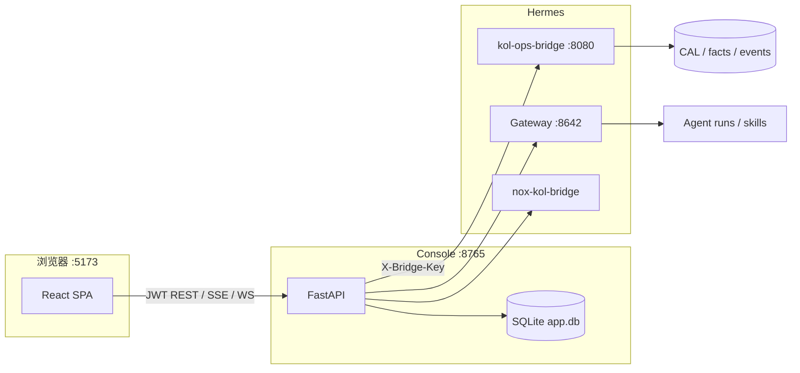

# KOL Ops Console — 总架构与目录地图

面向 **无技术背景操作员** 的 Web 控制台：本地 SQLite 管 SKU/用户/审计，**kol-ops-bridge** 管 CAL/事实/活动真相，**Hermes Gateway** 管 Agent 运行。

> 各业务模块细节见 [`docs/README.md`](docs/README.md) → `docs/features/<模块>/GUIDE.md`  
> 改 UI 前请先读 §5 与 [项目 UI 规则](../../../../.cursor/rules/agent-prj-guardrails.mdc) §5。

---

## 1. 运行时拓扑



**启动**：仓库根 `hermes-agent/playground/kol-ops-console/start.sh`（或分别起 bridge、uvicorn、`npm run dev`）。

**本地开发踩坑**：在 macOS 上若用 `http://localhost:5173` 打开前端，浏览器会把 API 打到 `http://localhost:8765`；部分机器上 **Logi Options+** 等软件已占用 `[::1]:8765`，而 Console 监听在 `0.0.0.0:8765`，结果页签显示「网络不通」。前端 `api.ts` 已对 `localhost` 改用 `127.0.0.1`；也可直接访问 `http://127.0.0.1:5173`。另需保证 **bridge :8080** 在跑，否则 REST 会 502。

| 进程 | 默认端口 | 入口 |
|------|----------|------|
| Frontend (Vite) | 5173 | `frontend/src/main.tsx` → `App.tsx` |
| Backend (uvicorn) | 8765 | `backend/app/main.py` → `create_app()` |
| kol-ops-bridge | 8080 | `hermes-agent/plugins/kol-ops-bridge/` |
| Hermes Gateway | 8642 | 配置 `KOC_GATEWAY_*` |

---

## 2. 状态归属（查数据去哪）

| 数据 | 权威来源 | Console 角色 |
|------|----------|----------------|
| 产品 SKU、变体矩阵 | SQLite `products` | 读写源 |
| 活动启动记录、run 登记 | SQLite `product_campaigns`, `run_registry` | 辅助索引 |
| 用户、JWT、审计 | SQLite `users`, `audit_log` | 源 |
| 操作员 Gmail OAuth | SQLite + 加密文件 | 源；bridge 经 `/internal` 取路径 |
| KOL 身份、事实、目标、审批、升级、学习 | Bridge CAL | **代理** + 少量合并 |
| Agent 运行、Gateway 审批 | Gateway | 启动/查询/审批 dock |
| Nox 配额/补充/尽调 | nox-kol-bridge + `backend/app/nox_*.py` | 门禁 + 调度 |

**环境**：所有 bridge 读写必须带 `env=TEST|LIVE`（前端 `lib/store.ts` + 后端 `KOC_ENV`）。禁止依赖隐式默认。

---

## 3. 目录结构（查文件入口）

```
kol-ops-console/
├── ARCHITECTURE.md          ← 本文件（总览）
├── README.md                ← 操作员向：学习 UI、驳回 API 等
├── docs/
│   ├── README.md            ← 功能指引索引
│   └── features/            ← 各系统功能 GUIDE.md
├── backend/
│   ├── app/
│   │   ├── main.py          # 路由挂载、lifespan
│   │   ├── config.py        # KOC_* 配置
│   │   ├── db.py            # SQLite schema
│   │   ├── bridge_client.py # → kol-ops-bridge
│   │   ├── gateway_client.py
│   │   ├── nox_*.py         # Nox 门禁/调度/工具
│   │   └── routers/         # HTTP API（见 routers/README.md）
│   └── tests/
├── frontend/
│   └── src/
│       ├── App.tsx          # 路由表
│       ├── api.ts           # REST/SSE 类型与客户端
│       ├── useLiveEvents.ts # WebSocket /ws
│       ├── pages/           # 页面（见 pages/README.md）
│       ├── components/      # 组件簇（见 components/README.md）
│       ├── hooks/
│       ├── lib/
│       └── constants/       # domainLabels, rejectTags
└── scripts/
```

---

## 4. 功能模块索引（系统功能 → 文档 → 代码）

| 模块 | 操作员入口 | 指引文档 |
|------|------------|----------|
| 认证与设置 | `/login`, `/settings` | [auth-settings](docs/features/auth-settings/GUIDE.md) |
| 产品 SKU | `/products` | [products](docs/features/products/GUIDE.md) |
| 活动 Campaign | `/products/:sku`, `/campaigns/:id/*` | [campaigns](docs/features/campaigns/GUIDE.md)（含发现门控 / `pending_ingests` 结构化续跑） |
| KOL 看板/详情 | `/kols`, `/kols/:id` | [kols](docs/features/kols/GUIDE.md) |
| 待审批 | `/approvals` | [approvals](docs/features/approvals/GUIDE.md) |
| 自主学习 | `/learning` | [learning](docs/features/learning/GUIDE.md) |
| 升级处理 | `/escalations` | [escalations](docs/features/escalations/GUIDE.md) |
| 策略编辑 | `/policies` | [policies](docs/features/policies/GUIDE.md) |
| 门禁指标 | `/metrics` | [gate-metrics](docs/features/gate-metrics/GUIDE.md) |
| Agent / Gateway | 浮层 dock、transcript | [agent-gateway](docs/features/agent-gateway/GUIDE.md) |
| Gmail | 设置、KOL 邮件历史 | [gmail](docs/features/gmail/GUIDE.md) |
| Nox | 产品页/活动 Nox 面板 | [nox](docs/features/nox/GUIDE.md) |
| 实时事件 | 全局 WS 刷新 | [live-events](docs/features/live-events/GUIDE.md) |

---

## 5. 前后端关联查法（Agent 工作流）

1. **从路由找页面**：`frontend/src/App.tsx` 的 `<Route path=…>` → `pages/*.tsx`
2. **从页面找 API**：页面内 `api.get/post` 路径 → `backend/app/routers/<name>.py`
3. **从 router 找上游**：`BridgeClient` 方法 → `hermes-agent/plugins/kol-ops-bridge/`；Gateway → `gateway_client.py`
4. **共享类型**：`frontend/src/api.ts` 与 router 返回 JSON 应对齐
5. **中文标签**：`constants/domainLabels.ts`、`components/factKeyLabel.ts`

**全局壳**：`components/shell/`（导航、TEST/LIVE、活动选择器）+ `AgentSessionDock` + `GatewayApprovalDock`（见 [agent-gateway](docs/features/agent-gateway/GUIDE.md)）。

---

## 6. 后端 Router 一览

挂载顺序见 `backend/app/main.py`（`include_router`）。

| Router 文件 | 前缀/范围 | 模块指引 |
|-------------|-----------|----------|
| `auth.py` | `/auth` | auth-settings |
| `google_auth.py` | `/auth/google` | gmail |
| `internal.py` | `/internal` | gmail |
| `products.py` | `/products` | products |
| `campaigns.py` | `/campaigns` | campaigns |
| `candidates.py` | `/campaigns/{id}/candidates` | campaigns |
| `kols.py` | `/kols` | kols |
| `facts.py` | `/facts` | kols |
| `goals.py` | `/identities` | kols |
| `relationships.py` | `/identities` | kols |
| `escalations.py` | `/escalations` | escalations |
| `approvals.py` | `/approvals` | approvals |
| `learning.py` | `/learning` | learning |
| `policies.py` | `/policies` | policies |
| `gateway_approvals.py` | `/gateway-approvals` | agent-gateway |
| `reply_watcher.py` | `/reply-watcher` | campaigns |
| `admin.py` | `/admin` | gate-metrics, auth-settings |
| `events.py` | `/events`, **`/ws`** | live-events |

---

## 7. 仓库外关联文档

| 路径 | 内容 |
|------|------|
| `agent_prj/docs/kol-nox-integration.md` | Nox ↔ Console |
| `agent_prj/docs/kol-learning-tier1-implementation.md` | 学习闭环 |
| `agent_prj/docs/kol-operator-gmail-onboarding.md` | Gmail 多邮箱 |
| `hermes-agent/plugins/kol-ops-bridge/` | CAL API 实现 |
| `hermes-agent/plugins/nox-kol-bridge/` | Nox 工具 |

---

## 8. 维护约定

与代码 **同次提交** 更新文档（项目 rules §6 Documentation Must Stay in Sync）：

- 新增 **操作员可见功能** → 新增或更新 `docs/features/<模块>/GUIDE.md`，本文件 §4 补一行。
- 新增 **router / 页面 / 组件簇** → 更新 `routers/README.md`、`pages/README.md`、`components/README.md`。
- API 契约变更 → 同步 `frontend/src/api.ts` 与模块 GUIDE 的 API 表。
