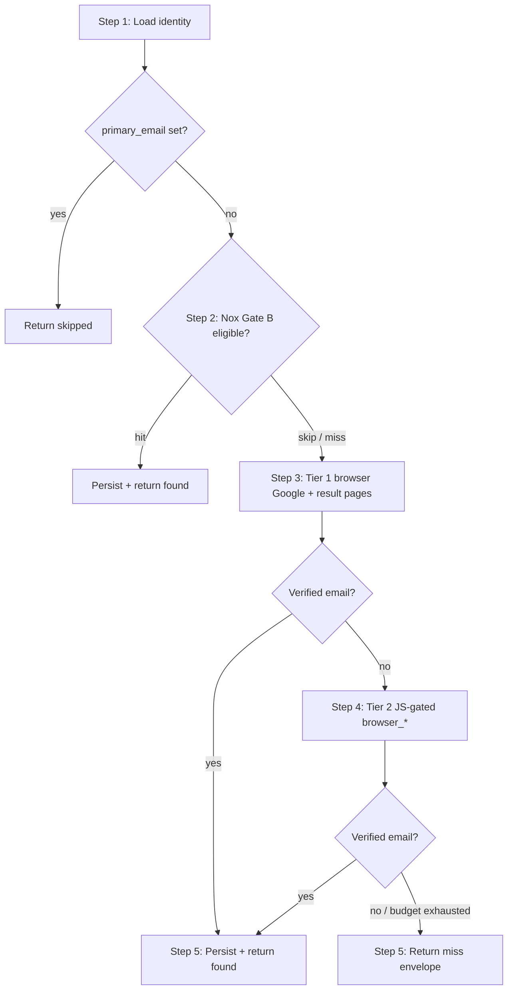

## Goal
Resolve a single KOL identity's **personal collaboration email** from public
sources so outreach draft skills have a direct `to:` address. Agency /
talent-management inboxes are a **last resort** only when no verified
creator-owned address exists within the page-load budget. Never fabricate —
a miss is a legitimate outcome (escalation, not invention).

## Workflow overview



| Step | What | Tools |
|------|------|-------|
| 1 | Load identity; abort if email exists | `kol_bridge_tool.py get-identity` |
| 2 | Nox contacts (when quota + config; skip if `gate_b_attempted: true`) | `nox_kol_tool.py contacts` |
| 3 | Tier 1 — Google SERP + link-in-bio / personal site / Facebook About | `browser_navigate`, `browser_snapshot` |
| 4 | Tier 2 — IG bio, lazy Linktree/Beacons, image emails (only if Tier 1 miss) | `browser_*`, `vision_analyze` |
| 5 | Hit → `upsert-identity` + `write-facts-multi`; miss → JSON envelope only | bridge CLI |

**Budget:** ≤ 8 rendered page loads total across Tier 1 + Tier 2. Google
SERP navigations and read-only `fb_creator` metadata do not count; every
opened result URL, link-in-bio, About page, and IG profile does.

**Preference:** exhaust creator-owned surfaces before accepting an agency
inbox. Maintain `personal_candidate` and `agency_candidate` in memory; persist
`personal_candidate` as soon as verified and higher-priority surfaces are
tried or skipped.

## Runtime contract
- Profile: `outreach-operator`.
- Bridge is the only CAL writer. Use
  `plugins/kol-ops-bridge/scripts/kol_bridge_tool.py` with `--env <TEST|LIVE>`.
  Forbidden: `cal.py`, direct DB access, ad-hoc SQL, `execute_code` against DB.
- **No sending, no drafting, no guessing.** Heuristic addresses
  (`firstname@brand-domain`, etc.) are forbidden even with `unverified`.
- **Single-shot:** non-empty `primary_email` → return
  `{"skipped": "already_has_email", "email": "<existing>"}` — never overwrite.

### Allowed tools

| Layer | Tools |
|-------|-------|
| CAL | `kol_bridge_tool.py` (`get-identity`, `upsert-identity`, `write-facts-multi`) |
| Nox Gate B | `nox_kol_tool.py contacts --gate pre_outreach_confirm` |
| Browser Tier 1 + 2 | `browser_navigate`, `browser_snapshot`, `browser_get_images`, `browser_click`, `vision_analyze` on **local debug Chrome** (auto-started by `local-chrome-tab-pool`) |

### Forbidden tools (hard)
`veedcrawl_*`, `delegate_task`, `mcp_chrome_devtools_*`, `web_search`,
`web_extract`, terminal curl/urllib/requests HTTP scraping, `execute_code`
with browser/hermes_tools imports. This skill is not `instagram-kol-discovery`.

## Inputs
1. `identity_id` (mandatory).
2. `env` (`TEST` or `LIVE`, mandatory).
3. (Optional) `campaign_id` — attached to provenance facts for audit.

Brief may also carry: `campaign_config_file`, `gate_b_attempted: true`,
`handle`.

---

## Procedure

### Step 1 — Load identity

```
python plugins/kol-ops-bridge/scripts/kol_bridge_tool.py get-identity \
  --identity-id <identity_id> --env <TEST|LIVE>
```

Use `primary_handle`, `platform`, `display_name`, `region`, `language`.
If `primary_email` is non-empty → abort with
`{"skipped": "already_has_email", "email": "<value>"}`.

### Step 2 — Nox Gate B (before browser, when eligible)

Run **only when all** of the following hold:
- Brief has `campaign_config_file:` and `gate_b_attempted` is **not** `true`.
- Campaign has `nox_quota_enabled`.
- You have `nox_creator_id` or platform + profile URL from identity/facts.

```
python3 plugins/nox-kol-bridge/scripts/nox_kol_tool.py contacts \
  --env LIVE --gate pre_outreach_confirm \
  --campaign-config-file <campaign_config_file> \
  [--nox-creator-id <id> | --platform <platform> --url <profile_url>]
```

| Outcome | Next action |
|---------|-------------|
| Valid email returned | `upsert-identity` + `write-facts-multi` (`identity.email_source=noxinfluencer_api`) → **stop** (no browser) |
| `gate_b_attempted: true` in brief | Console already ran Nox (hit or miss) → **do not** call Nox again → Step 3 |
| No `campaign_id` / no config | Gate B skipped on Console → Step 3 (optionally run Nox if you still have config + creator id) |

### Step 3 — Tier 1: Local Chrome Google search + result pages

All page fetches use built-in `browser_*` on local debug Chrome. Do **not**
use `web_search`, `web_extract`, or terminal HTTP.

#### Browser discipline (Tier 1 + Tier 2 — hard)

Local debug Chrome auto-starts on the first `browser_*` call — do not open
a browser manually.

- **One URL, one attempt.** Navigate/snapshot error, timeout, or empty
  content → record in `tried`, move on — never retry the same URL.
- **~30s per page.** Abandon slow pages; record and continue.
- **8-load budget.** When spent → return miss envelope immediately.
- **Autostart failure** → miss with `reason_hint: "browser_unavailable"`.
- **Concurrency:** one `kol-email-discovery` at a time per gateway.
- **No workarounds:** guard blocks `delegate_task`, terminal HTTP, etc.

Record Google queries as `browser_google:"..."`; record opened URLs as the
URL string in `tried`.

#### Surface-priority checklist

Try in order (creator-owned first, agency last):

1. Link-in-bio — Linktree / Beacons / bio.link / lnk.bio / solo.to / linkin.bio
2. Personal site — `/contact`, `/about`, `/work-with-me`, `/press`, `/media-kit`
3. Platform profiles — IG bio (Tier 2 if JS-gated); Facebook About/Contact
4. Media kit on creator domain or link-in-bio
5. **Google via browser** — queries below → open creator-owned results first
6. Agency roster — **fallback only**; store in `agency_candidate`, do not
   persist while surfaces 1–4 remain untried within budget

#### Google queries (Path A)

For each query:

```
browser_navigate url="https://www.google.com/search?q=<url_encoded_query>"
browser_snapshot
```

Then open promising creator-owned result URLs with `browser_navigate` +
`browser_snapshot`.

1. `"<handle>" (email OR contact OR "business inquiries" OR collab OR partnership)`
2. `"<display_name>" "<region>" (email OR contact OR "business inquiries")` — if needed for disambiguation
3. `site:instagram.com "<handle>" (email OR contact OR "business inquiries")`
4. `(site:linktr.ee OR site:beacons.ai OR site:bio.link) "<handle>"`
5. `"<handle>" (site:<personal_domain> OR "<personal_domain>") contact` — when domain known from CAL/prior hit
6. `site:facebook.com "<handle>" (email OR contact OR "business inquiries" OR "about")`
7. `"<display_name>" "<handle>" (talent OR management OR agency OR "represented by")` — **fallback only**

Add local-language contact words from `language` / `region` when obvious
(e.g. `合作`, `商务`, `pr`, `contacto`).

#### Direct URL opens (Path B)

For link-in-bio, `/contact`, Facebook About, etc.:

```
browser_navigate url="<url>"
browser_snapshot
```

Never accept an email from a Google snippet alone — it must appear in the
page snapshot on a page that visibly belongs to the creator.

#### Facebook path (Path C)

When platform is Facebook, CAL has a Facebook URL, or `fb_creator` applies:

1. `browser_navigate` to public profile/Page About URL.
2. `fb_creator` may resolve `profile_url` only — then `browser_navigate` there.
3. Login wall or Messenger only → record URL in `tried`, continue. No login/DM.

Common URLs when Google or CAL surfaces them:
`linktr.ee/<handle>`, `beacons.ai/<handle>`, `facebook.com/<handle>/about`,
`<handle>.com` only when search already points there.

### Step 4 — Tier 2: JS-gated surfaces (only if Step 3 found no verified email)

Reserved for Instagram bio, Linktree/Beacons behind clicks, lazy-loaded
contact blocks. Same `browser_*` tools and discipline as Step 3.

Browse sequence:
1. `https://www.instagram.com/<handle>/` — bio text + link-in-bio URL
2. Link-in-bio target (Linktree / Beacons / personal site)
3. Personal site Contact / About / Press / Work-with-me subpages
4. Facebook profile/Page/About (when relevant)
5. Bio email in image → `browser_get_images` + `vision_analyze`:
   `"Extract any email addresses visible in this image. Reply with addresses only, one per line, or 'NONE'."`
6. Agency roster — **only when** steps 1–5 found no `personal_candidate`

Apply verification and classification rules below to all Tier 1 + Tier 2
candidates.

### Verification & classification (all tiers)

**Verify** — candidate must pass ALL:
- On a page visibly belonging to the creator (or official agency page listing
  them by name + handle).
- Not a role inbox of an unrelated brand.
- Not `noreply@`, `donotreply@`, `notifications@`.
- Not Mailchimp / Substack reflectors.

**Classify:**
- **Personal** (`personal_candidate`) — creator domain/site/bio; labeled
  collab/PR/partnerships on creator-owned page.
- **Agency** (`agency_candidate`) — talent/MCN domain; "represented by" copy;
  roster with multiple creators. Persist only after creator paths exhausted.

**Email priority on same page:** (1) personal labeled collab/PR, (2) personal
`mailto:` with creator name, (3) other personal on contact page, (4) agency
scoped to creator, (5) generic agency inbox.

**Persistence trigger:** when `personal_candidate` verified and higher-priority
surfaces tried/skipped → Step 5 immediately. When only `agency_candidate` →
finish checklist + Tier 2 within budget first.

### Step 5 — Return envelope

#### 5a — On hit: persist then return

Winning address: `personal_candidate` if set, else `agency_candidate`.

```
python plugins/kol-ops-bridge/scripts/kol_bridge_tool.py upsert-identity \
  --primary-handle <handle> --primary-email <email> --env <TEST|LIVE>
```

```
python plugins/kol-ops-bridge/scripts/kol_bridge_tool.py write-facts-multi \
  --identity-id <identity_id> --env <TEST|LIVE> \
  --json '{"campaign_id":"<campaign_id_or_null>",
            "source":"skill:kol-email-discovery",
            "namespaces":{
              "identity": {
                "identity.email_source":         "<linktree|ig_bio|google_search_result|facebook_about|personal_site|media_kit|agency_page|noxinfluencer_api|...>",
                "identity.email_discovered_at":  "<iso8601>",
                "identity.email_discovered_url": "<verbatim URL>",
                "identity.email_discovery_tier": "<1|2>"
              }
            }}'
```

If `upsert-identity` succeeds but `write-facts-multi` fails → fix payload,
retry facts only — do not roll back email.

**Side effect (no extra budget):** while browsing, capture unset social URL
facts from pages already loaded (do not open extra pages):

| Domain | Fact key |
|--------|----------|
| `instagram.com/...` | `identity.instagram_profile_url` |
| `tiktok.com/@...` | `identity.tiktok_profile_url` |
| `youtube.com/...`, `youtu.be/...` | `identity.youtube_profile_url` |
| `facebook.com/...`, `fb.com/...` | `identity.facebook_profile_url` |
| `twitter.com/...`, `x.com/...` | `identity.twitter_profile_url` |
| `threads.net/@...`, `threads.com/@...` | `identity.threads_profile_url` |
| link-in-bio domains | `identity.linktree_url` |
| Creator personal domain | `identity.personal_site_url` |

Add each with provenance triple (`_source`, `_discovered_at`, `_discovered_url`).
Do not overwrite non-empty existing values. Do not fabricate URLs from bare handles.

Return JSON only:

```json
{
  "skill": "kol-email-discovery",
  "identity_id": 42,
  "env": "TEST",
  "found": true,
  "email": "collab@janedoe.com",
  "source": "ig_bio",
  "email_class": "personal",
  "tier": 2,
  "discovered_url": "https://www.instagram.com/janedoe/",
  "tried": ["browser_google:\"@janedoe\" email contact", "https://linktr.ee/janedoe", "https://www.instagram.com/janedoe/"]
}
```

Agency fallback (after creator surfaces exhausted):

```json
{
  "skill": "kol-email-discovery",
  "identity_id": 42,
  "env": "TEST",
  "found": true,
  "email": "talent@example-agency.com",
  "source": "agency_page",
  "email_class": "agency",
  "tier": 1,
  "discovered_url": "https://example-agency.com/talent/janedoe",
  "tried": ["https://linktr.ee/janedoe", "https://www.instagram.com/janedoe/", "browser_google:\"@janedoe\" talent management", "https://example-agency.com/talent/janedoe"]
}
```

#### 5b — On miss: return only (orchestrator escalates)

Do **not** open an escalation from this skill. Return:

```json
{
  "skill": "kol-email-discovery",
  "identity_id": 42,
  "env": "TEST",
  "found": false,
  "tried": [
    "browser_google:\"@handle\" email contact",
    "https://linktr.ee/handle",
    "https://www.instagram.com/handle/",
    "https://handle.com/contact"
  ],
  "reason_hint": "no verified address on bio, link-in-bio, or personal site"
}
```

Orchestrator / Console run should call `open-escalation` with
`reason="contact_email_not_found"` and the `tried` list.

---

## Examples

### Success — IG bio (Tier 2)
Handle `@janedoe`. Tier 1 Google finds link-in-bio but no email. Tier 2
IG snapshot shows `collab@janedoe.com` in bio → persist, `tier: 2`,
`source: ig_bio`.

### Success — link-in-bio (Tier 1)
Google result → `beacons.ai/janedoe` → snapshot shows business email on
creator-branded page → persist immediately, `tier: 1`, `source: linktree`.

### Miss — budget exhausted
Six page loads, no verified address → return `found: false` with full
`tried` list. No escalation from skill.

### Skipped — email already set
`get-identity` returns non-empty `primary_email` →
`{"skipped": "already_has_email", "email": "..."}`.

### Nox Gate B hit
Brief has `campaign_config_file`, Nox returns email → persist with
`identity.email_source=noxinfluencer_api`, skip browser entirely.

## Pitfalls
- Tier 1 Google = `browser_navigate` to `google.com/search?q=...` +
  `browser_snapshot` — never `web_search` / terminal HTTP.
- Never `veedcrawl_*`, `delegate_task`, or MCP Chrome for email lookup.
- Never guess addresses; never persist agency while IG bio / link-in-bio /
  personal `/contact` remain untried within budget.
- Never accept Google snippets without opening and verifying the source page.
- Never log into Facebook or use Messenger as email.
- Never invoke draft skills from here — return envelope only.
- Eight page loads is a hard ceiling.
